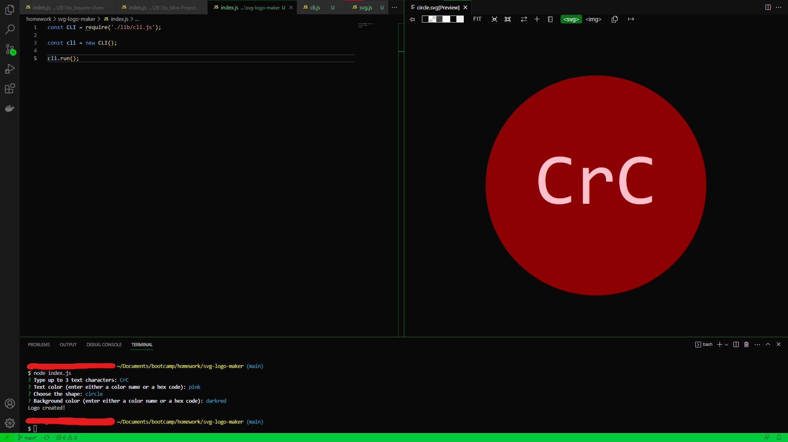

# SVG Logo Maker

## Description

This logo generator creates a customized SVG image file. The user can choose between three shapes (circle, square, triangle) with custom colors and up to 3 characters.

Node.js, inquirer.js, and object-oriented programming (specifically classes) were utilized to form interconnected files and code.

## Installation

If Node.js is not already installed in your system, you can get it at <https://nodejs.org>. Once installed, download the files in the repository. The files can then be accessed/opened in a command line window (either Command Prompt, Terminal, or Git Bash depending on what your system & what you have installed).

## Usage

Open the folder containing the files via command line window. Type "node index.js", then answer the prompts to generate an SVG logo file in the same folder.

## Credits

Special thanks to the University of Minnesota - Twin Cities for kickstarting my coding journey.

## License

MIT License

Copyright (c) [2023] [Andrew Joo]

Permission is hereby granted, free of charge, to any person obtaining a copy
of this software and associated documentation files (the "Software"), to deal
in the Software without restriction, including without limitation the rights
to use, copy, modify, merge, publish, distribute, sublicense, and/or sell
copies of the Software, and to permit persons to whom the Software is
furnished to do so, subject to the following conditions:

The above copyright notice and this permission notice shall be included in all
copies or substantial portions of the Software.

THE SOFTWARE IS PROVIDED "AS IS", WITHOUT WARRANTY OF ANY KIND, EXPRESS OR
IMPLIED, INCLUDING BUT NOT LIMITED TO THE WARRANTIES OF MERCHANTABILITY,
FITNESS FOR A PARTICULAR PURPOSE AND NONINFRINGEMENT. IN NO EVENT SHALL THE
AUTHORS OR COPYRIGHT HOLDERS BE LIABLE FOR ANY CLAIM, DAMAGES OR OTHER
LIABILITY, WHETHER IN AN ACTION OF CONTRACT, TORT OR OTHERWISE, ARISING FROM,
OUT OF OR IN CONNECTION WITH THE SOFTWARE OR THE USE OR OTHER DEALINGS IN THE
SOFTWARE.
